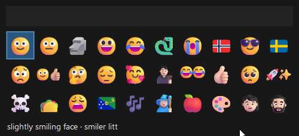
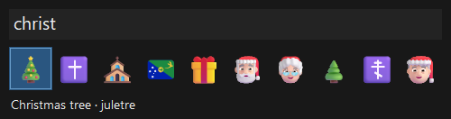
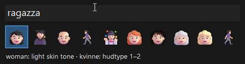
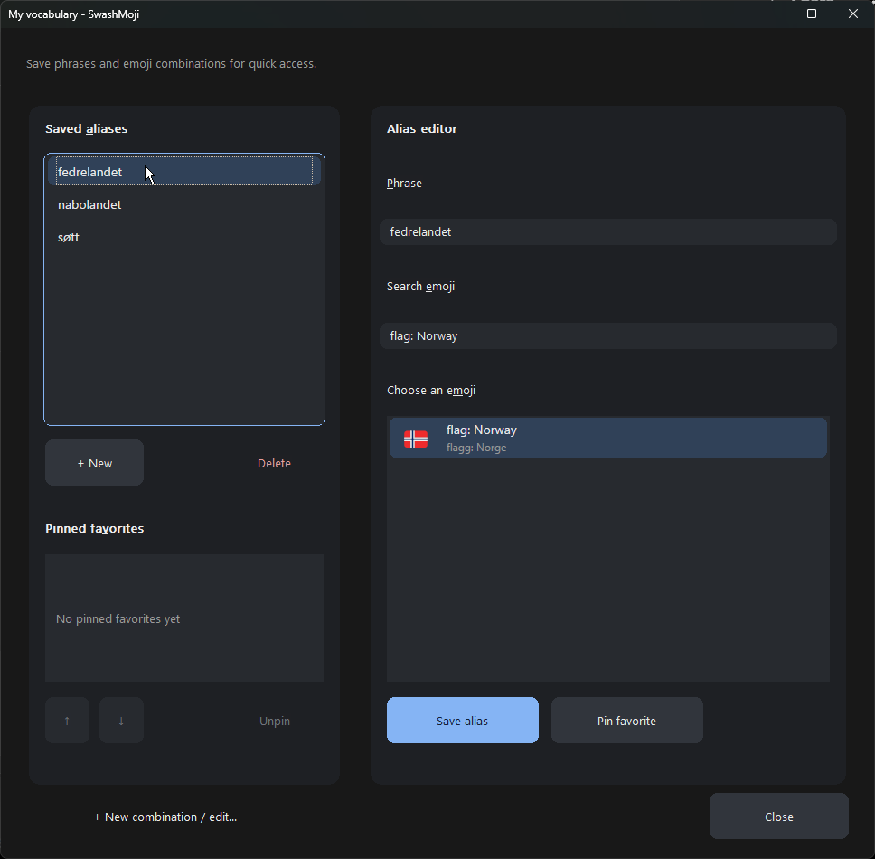
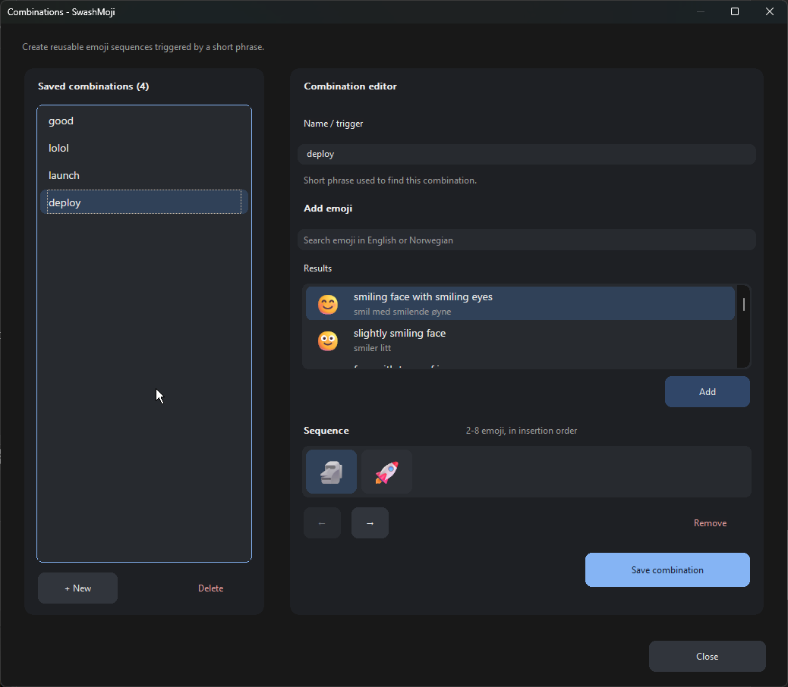

# SwashMoji

**The fast Windows emoji picker that learns your vocabulary.**

SwashMoji is a lightweight, native emoji picker built for people who use emoji often and want to find the right one instantly.

Press **Alt+E** and start typing. SwashMoji learns which emoji you actually use and brings your favorites to the front. Press **Alt+T** to switch between recently used and most-used emoji.

Search naturally across multiple languages — no language switching required. SwashMoji searches every supported language at once, while displaying emoji names in **one or two languages you choose**.

Make the vocabulary yours with **custom aliases, pinned favorites, and reusable emoji combinations**. Turn the words you actually type into the emoji and sequences you actually want.

And because SwashMoji is a **native Windows app**, it launches instantly, stays tiny in the background, and doesn't bring an entire browser engine along for the ride.

**Fast. Personal. Multilingual. Native.**

**SwashMoji — your emoji picker should know your vocabulary.** 🙂🚀

## Screenshots

**Your emoji, ready to use.** Browse the compact picker with names in your chosen languages.



**Find the right emoji as you type.** Searching `christ` brings up Christmas-related results.



**Search across languages.** Type the Italian `ragazza` while keeping names displayed in English and Norwegian.



**Make words your own.** Create custom aliases and manage pinned favorites in **My vocabulary**.



**Save a whole sequence.** Build reusable emoji combinations under a short name or trigger.



## Essential shortcuts

| Key | Action |
| --- | --- |
| `Alt+E` | Open the picker |
| `Enter` | Insert without changing the clipboard |
| `Ctrl+Enter` | Insert and keep the picker open |
| `Shift+Enter` | Copy to the clipboard |
| `Esc` / `F1` | Close / show help |

## Build it yourself

With Visual Studio 2022 C++ Build Tools installed, run from the project directory:

```powershell
.\build.cmd
```

Launch `build\SwashMoji.exe`. The script finds the toolchain automatically.
See the [user guide](docs/user-guide.md#startup-and-tray-menu) before moving the application.

## Documentation

- [User guide](docs/user-guide.md) – all features, shortcuts, and settings.
- [Search and languages](docs/search.md), [learning](docs/learning.md), and [combinations](docs/combinations.md) – details and rules.
- [Contributing](CONTRIBUTING.md) – building, testing, and technical documentation.
- [Release status](docs/release-validation.md) – verified results and remaining testing.

Search names and keywords are based on Unicode CLDR, under the
[Unicode License v3](third_party/UNICODE_LICENSE.txt).
